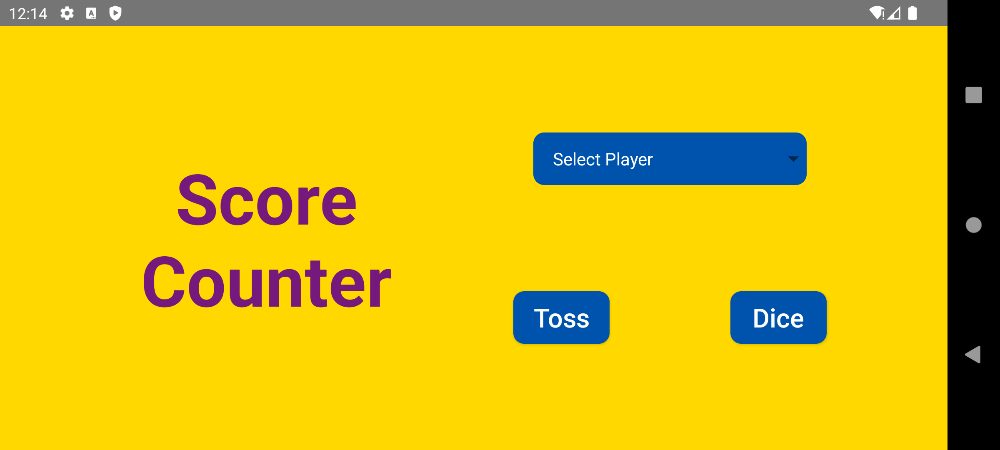
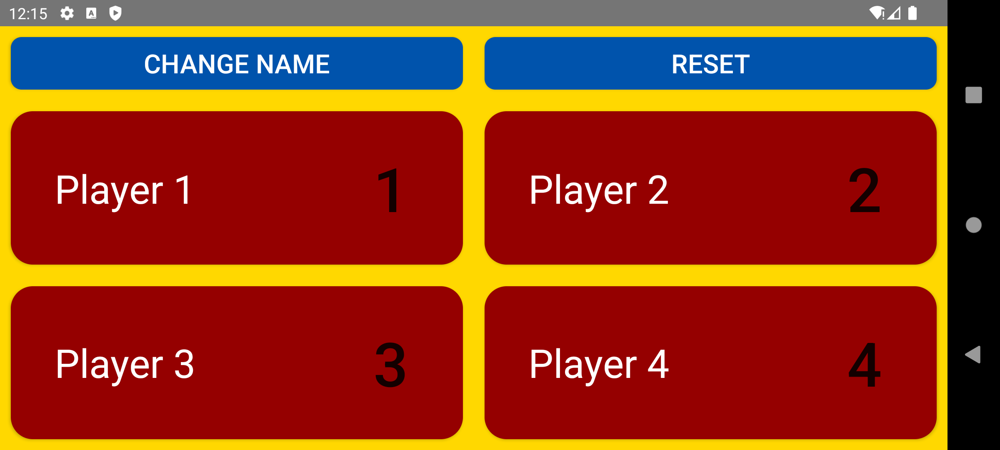
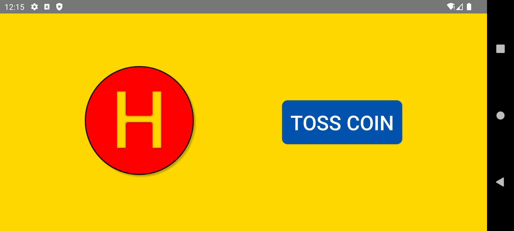
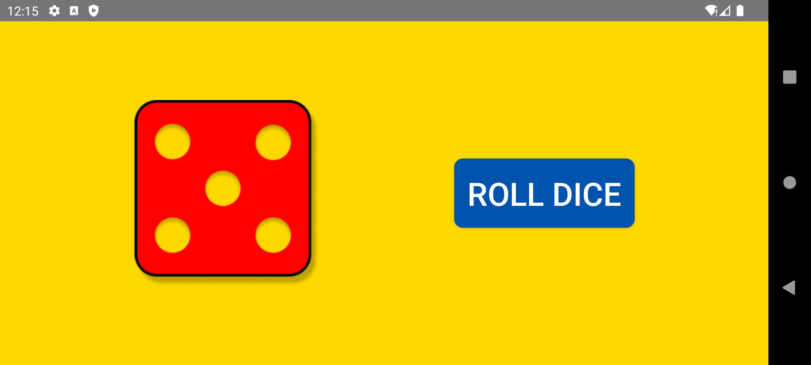

# Score Counter

A simple Android app to keep score for 1 to 4 players, with built-in coin toss and dice roll utilities — handy for board games and card games.

## Screenshots

**Player Setup**

**Score Counter**

**Toss**

**Dice**

## Features

- Select number of players (1–4)
- Set custom names for each player
- Track score for each player:
    - Single press to increment score by 1
    - Long press to decrement score by 1
- **Toss** — flip a coin for heads/tails
- **Dice** — roll a single die (1–6) for reference

## Tech Stack

- **Java**
- **XML** — UI layouts

## Status

This project is feature-complete and not under active development.